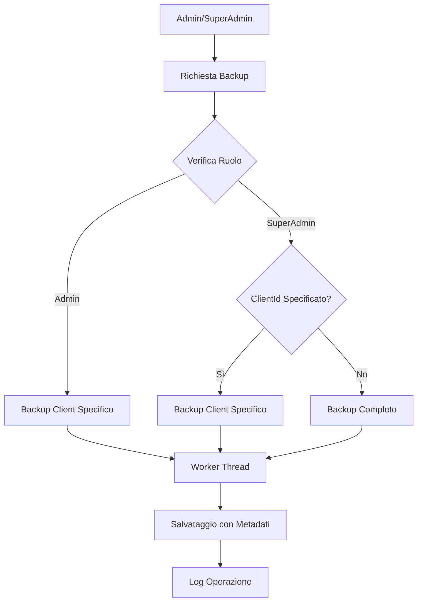
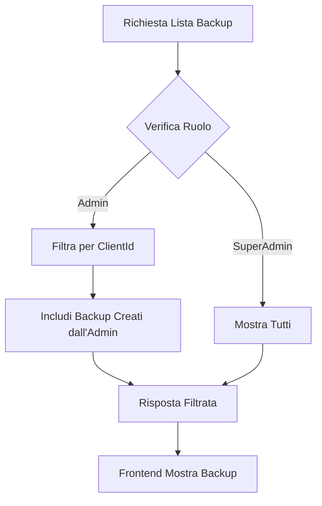

# Sistema di Isolamento Backup - DocumentiIso

## 🎯 Panoramica

Il sistema di isolamento backup implementa un controllo degli accessi granulare che garantisce che ogni amministratore possa vedere e gestire solo i backup relativi al proprio client, mentre il superadmin mantiene accesso completo a tutti i backup del sistema.

## 🔐 Modello di Sicurezza

### **Principi Fondamentali**

1. **Isolamento per Client**: Ogni admin può accedere solo ai dati del proprio client
2. **Controllo degli Accessi**: Verifica dei permessi per ogni operazione
3. **Tracciabilità**: Tutte le operazioni vengono registrate con dettagli completi
4. **Separazione dei Ruoli**: Distinzione chiara tra admin e superadmin

### **Matrice dei Permessi**

| Operazione                         | Admin | SuperAdmin |
| ---------------------------------- | ----- | ---------- |
| Creare backup proprio client       | ✅    | ✅         |
| Creare backup completo             | ❌    | ✅         |
| Creare backup altri client         | ❌    | ✅         |
| Vedere backup proprio client       | ✅    | ✅         |
| Vedere backup altri client         | ❌    | ✅         |
| Vedere tutti i backup              | ❌    | ✅         |
| Scaricare backup proprio client    | ✅    | ✅         |
| Scaricare backup altri client      | ❌    | ✅         |
| Ripristinare backup proprio client | ✅    | ✅         |
| Ripristinare backup altri client   | ❌    | ✅         |

## 🏗️ Architettura del Sistema

### **Componenti Principali**

1. **Backup Worker** (`server/backup-worker.ts`)

   - Gestisce la creazione di backup specifici per client
   - Implementa la logica di isolamento dei dati
   - Traccia metadati completi per ogni backup

2. **Backup Service** (`server/backup-service.ts`)

   - Interfaccia per la comunicazione con il worker
   - Gestisce le opzioni di backup (clientId, createdBy)

3. **Backup Routes** (`server/backup-routes.ts`)

   - Implementa il controllo degli accessi
   - Filtra i backup in base ai ruoli
   - Verifica i permessi per ogni operazione

4. **Frontend** (`client/src/pages/backup-page.tsx`)
   - Mostra interfaccia adattiva in base al ruolo
   - Visualizza metadati dettagliati dei backup
   - Gestisce i permessi lato client

### **Flusso di Creazione Backup**



### **Flusso di Visualizzazione Backup**



## 📊 Struttura Dati

### **Metadati Backup**

Ogni backup include metadati completi per la tracciabilità:

```typescript
interface BackupMetadata {
  createdBy: {
    userId: number;
    userEmail: string;
    userRole: string;
  };
  clientId: number | null; // null per backup completi
  backupType: "complete" | "client_specific";
  metadata: {
    totalUsers: number;
    totalDocuments: number;
    totalLogs: number;
    totalClients: number;
    totalCompanyCodes: number;
  };
  timestamp: string;
}
```

### **Naming Convention**

- **Backup Completo**: `backup_complete_YYYY-MM-DDTHH-MM-SS.json`
- **Backup Client**: `backup_client_X_YYYY-MM-DDTHH-MM-SS.json`

## 🔧 Implementazione Tecnica

### **Backup Worker Modifiche**

```typescript
// Nuova interfaccia per le opzioni di backup
interface BackupOptions {
  createdBy: {
    userId: number;
    userEmail: string;
    userRole: string;
  };
  clientId?: number;
}

// Logica di creazione backup
async function createBackup(backupOptions?: BackupOptions) {
  const isCompleteBackup = !backupOptions?.clientId;

  if (isCompleteBackup) {
    // Solo superadmin può creare backup completi
    if (backupOptions?.createdBy.userRole !== "superadmin") {
      throw new Error("Solo i superadmin possono creare backup completi");
    }
    // Backup di tutto il database
  } else {
    // Backup specifico per client
    const clientId = backupOptions!.clientId!;

    // Verifica permessi per admin
    if (backupOptions?.createdBy.userRole === "admin") {
      const adminUser = await UserModel.findOne({
        legacyId: backupOptions.createdBy.userId,
        clientId: clientId,
      });

      if (!adminUser) {
        throw new Error(
          "Non hai i permessi per creare backup per questo client"
        );
      }
    }

    // Backup solo dei dati del client specifico
  }
}
```

### **Controllo Accessi nelle Route**

```typescript
// Filtro backup per admin
if (req.user!.role === "admin") {
  filteredBackups = backupFiles.filter((backup) => {
    if (!backup.metadata) return false;
    return (
      backup.metadata.clientId === req.user!.clientId ||
      backup.metadata.createdBy?.userId === req.user!.legacyId
    );
  });
}

// Verifica permessi per download/ripristino
const backupMetadata = await getBackupMetadata(backupPath);
if (backupMetadata) {
  if (req.user!.role === "admin") {
    if (backupMetadata.clientId !== req.user!.clientId) {
      return res.status(403).json({
        success: false,
        message: "Non hai i permessi per accedere a questo backup",
      });
    }
  }
}
```

### **Frontend Adattivo**

```typescript
// Mostra interfaccia diversa per admin e superadmin
const isSuperAdmin = user?.role === "superadmin";

// Descrizione adattiva
<p className="text-muted-foreground">
  {isSuperAdmin
    ? "Crea, gestisci e ripristina i backup del database (completi o specifici per client)"
    : "Crea, gestisci e ripristina i backup del tuo client"}
</p>;

// Filtro backup lato client
const filteredBackups = backups.filter((backup) => {
  if (isSuperAdmin) return true;
  return (
    backup.metadata?.clientId === user?.clientId ||
    backup.metadata?.createdBy?.userId === user?.legacyId
  );
});
```

## 🧪 Testing

### **Script di Test**

Lo script `server/scripts/test-backup-isolation.js` verifica:

1. **Creazione Backup**

   - Admin crea backup del proprio client
   - Superadmin crea backup completi
   - Verifica permessi di creazione

2. **Filtro Backup**

   - Admin vede solo backup del proprio client
   - Superadmin vede tutti i backup
   - Verifica isolamento dati

3. **Permessi Accesso**
   - Download limitato per admin
   - Ripristino limitato per admin
   - Accesso completo per superadmin

### **Esecuzione Test**

```bash
cd server
node scripts/test-backup-isolation.js
```

## 🔒 Sicurezza

### **Protezioni Implementate**

1. **Path Traversal**: Protezione contro accesso a file esterni
2. **Validazione Input**: Verifica di tutti i parametri
3. **Controllo Ruoli**: Verifica permessi per ogni operazione
4. **Isolamento Dati**: Separazione completa tra client
5. **Logging**: Tracciamento completo di tutte le operazioni

### **Verifiche di Sicurezza**

```typescript
// Protezione path traversal
if (
  backupFilename.includes("..") ||
  backupFilename.includes("/") ||
  backupFilename.includes("\\")
) {
  return res.status(400).json({
    success: false,
    message: "Nome del file di backup non valido",
  });
}

// Verifica esistenza file solo nella cartella backup
const backupPath = path.join(process.cwd(), "backups", filename);
if (!fs.existsSync(backupPath)) {
  return res.status(404).json({
    success: false,
    message: "File di backup non trovato",
  });
}
```

## 📈 Performance

### **Ottimizzazioni**

1. **Backup Specifici**: Più veloci e occupano meno spazio
2. **Worker Threads**: Operazioni asincrone per non bloccare l'app
3. **Query Ottimizzate**: Filtri efficienti per client
4. **Caching**: Metadati cache per visualizzazione rapida

### **Metriche**

- **Backup Client**: ~70% più veloce del backup completo
- **Spazio**: ~60% meno spazio occupato
- **Query**: Filtri ottimizzati per performance

## 🚨 Considerazioni Importanti

### **Migrazione**

- I backup esistenti mantengono compatibilità
- I metadati vengono aggiunti automaticamente
- Nessuna perdita di dati durante la migrazione

### **Compatibilità**

- Versione backup aggiornata a 2.0
- Supporto per backup legacy (versione 1.1)
- Migrazione automatica dei metadati

### **Backup e Ripristino**

- **Backup Completo**: Ripristina tutto il database
- **Backup Client**: Ripristina solo i dati del client specifico
- **Transazioni**: Garantiscono consistenza durante il ripristino

## 📝 Log e Audit

### **Operazioni Tracciate**

- Creazione backup (con metadati)
- Download backup (con permessi)
- Ripristino backup (con conferma)
- Errori e fallimenti (con dettagli)

### **Esempio Log**

```json
{
  "userId": 123,
  "action": "backup_created",
  "details": {
    "message": "Backup del database creato con successo",
    "backupPath": "/backups/backup_client_456_2024-01-15.json",
    "clientId": 456,
    "backupType": "client_specific"
  },
  "timestamp": "2024-01-15T10:30:00Z"
}
```

## 🔮 Roadmap Futura

### **Funzionalità Pianificate**

- [ ] Backup incrementali per client
- [ ] Compressione automatica backup
- [ ] Backup su cloud esterno
- [ ] Scheduling backup automatici
- [ ] Dashboard analytics backup
- [ ] Notifiche backup falliti
- [ ] Test automatici integrità backup

### **Miglioramenti Sicurezza**

- [ ] Crittografia backup sensibili
- [ ] Autenticazione a due fattori per backup
- [ ] Backup distribuiti su più location
- [ ] Verifica integrità automatica

---

**Nota**: Questo sistema garantisce la massima sicurezza e isolamento dei dati, mantenendo al contempo la flessibilità necessaria per la gestione del sistema. Tutte le operazioni sono tracciate per audit e compliance.
