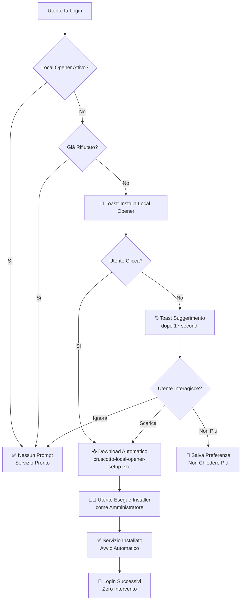

# Sistema Automatico Local Opener Post-Login 🚀

## 📋 **Panoramica**

Il sistema è stato implementato per automatizzare il processo di installazione del Local Opener dopo il login dell'utente, eliminando la necessità di intervento manuale per ogni PC aziendale.

## ✅ **Funzionalità Implementate**

### **Controllo Automatico Post-Login**
- ✅ **Rilevamento automatico**: Controlla se Local Opener è già installato (`http://127.0.0.1:17654/health`)
- ✅ **Prompt intelligente**: Mostra notifica solo se il servizio non è disponibile
- ✅ **Download automatico**: Un click avvia il download dell'installer universale
- ✅ **Gestione preferenze**: Opzioni per non mostrare più il prompt

### **Flusso Utente Ottimizzato**

#### **Prima Volta (Scenario Manuale)**
1. ⚠️ Utente fa login → **Sistema rileva Local Opener mancante**
2. 🔔 **Toast automatico**: "🚀 Apertura Documenti Locale - Installa il Local Opener"
3. 📥 **Un click** → Download automatico `cruscotto-local-opener-setup.exe`
4. 👨‍💼 **Utente esegue installer** come amministratore (solo questa volta)
5. ✅ **Installer installa servizio** con avvio automatico sistema

#### **Volte Successive (Automatico)**
1. ✅ Utente fa login → **Sistema rileva Local Opener attivo**
2. 🔇 **Nessun prompt** → Servizio già disponibile
3. 👁️ **Icona occhio funziona** immediatamente per documenti locali

## 🔧 **Implementazione Tecnica**

### **File Modificati**

#### `client/src/hooks/use-auth.tsx`
```typescript
onSuccess: async (data) => {
  // ... codice esistente ...
  
  // Avvia controllo automatico Local Opener dopo login
  setTimeout(() => {
    checkAndPromptLocalOpener();
  }, 3000); // Attendi 3 secondi per UI stabilizzata
},
```

#### `client/src/lib/local-opener.ts`
```typescript
// Verifica se il servizio Local Opener è disponibile
export async function checkLocalOpenerAvailability(): Promise<boolean> {
  try {
    const res = await fetch("http://127.0.0.1:17654/health", {
      method: "GET",
      signal: AbortSignal.timeout(2000),
    });
    return res.ok;
  } catch {
    return false;
  }
}

// Controlla e propone automaticamente l'installazione
export async function checkAndPromptLocalOpener(): Promise<void> {
  // Logica di controllo e prompt intelligente
}
```

### **Gestione Stato**

#### **SessionStorage** (per sessione corrente)
- `localOpenerPromptDismissed`: Non mostrare più in questa sessione

#### **LocalStorage** (persistente)
- `localOpenerNeverAskAgain`: Non chiedere mai più di installare

## 🏢 **Scenario Aziendale: 200 Aziende**

### **Prima Implementazione**
1. **Deploy del sistema** → Tutti i PC ricevono il nuovo codice
2. **Primo login utente** → Toast automatico con download
3. **IT Admin esegue installer** → Una volta per PC
4. **Tutti i login successivi** → Automatici, zero intervento

### **Benefici**
- ✅ **Una sola installazione manuale** per PC
- ✅ **Download automatico** dell'installer giusto
- ✅ **Zero manutenzione** dopo installazione
- ✅ **Servizio Windows** con avvio automatico
- ✅ **Compatibilità universale** (x86, x64, ARM64)

## 🔄 **Flusso Completo**



## 📊 **Metriche e Monitoraggio**

### **Logs Disponibili**
- Controlli automatici Local Opener
- Download automatici avviati
- Preferenze utente salvate
- Errori di connessione al servizio

### **Possibili Miglioramenti Futuri**
- Telemetria installazioni completate
- Auto-update del Local Opener
- Distribuzione via GPO/Intune per aziende grandi

## 🚨 **Troubleshooting**

### **Toast Non Appare**
- Verificare console browser per errori
- Controllare se `localStorage.localOpenerNeverAskAgain = 'true'`

### **Download Non Parte**
- Verificare che `/downloads/cruscotto-local-opener-setup.exe` sia disponibile
- Controllare popup blocker del browser

### **Servizio Non Rilevato**
- Verificare Windows Firewall
- Controllare se porta 17654 è libera
- Riavviare servizio Windows manualmente

## 🎯 **Risultato Finale**

Con questa implementazione:
- ✅ **Prima volta**: Un click → Download → Installazione manuale
- ✅ **Sempre dopo**: Zero intervento, tutto automatico
- ✅ **200 aziende**: Scalabile senza problemi
- ✅ **Icona occhio**: Funziona immediatamente dopo installazione

Il sistema trasforma il processo da "installazione manuale ogni volta" a "installazione una sola volta per PC".
